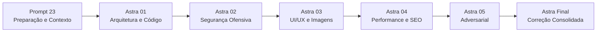

# Plano de Auditorias Astra
## Instituto Mente em Foco — Série de Auditorias GPT Astra 6

> [!IMPORTANT]
> Este documento define o roteiro das auditorias independentes que o GPT Astra 6 realizará sobre o projeto Instituto Mente em Foco. Cada etapa Astra tem escopo, arquivos prioritários, entradas e saídas bem definidos.

> [!CAUTION]
> O Astra deve tratar todos os relatórios anteriores como **contexto histórico**, não como prova de correção. Verificar código e comportamento independentemente.

---

## Visão Geral da Série

---

## Astra 01 — Arquitetura, Qualidade de Código e Dívida Técnica

**Objetivo:** Auditoria técnica profunda do código-fonte Django. Identificar dívida técnica, código morto, duplicações, problemas de arquitetura e desvios das boas práticas do framework.

**Escopo:**
- Estrutura de apps e responsabilidades
- Modelos Django (models.py) — campos, relacionamentos, validações, migrations
- Views — lógica de negócio, separação de concerns, queries N+1
- Forms — validações server-side, campos honey-pot
- URLs — organização, namespacing, rotas desnecessárias
- Admin — customizações, permissões, ações
- Dependências — versões, vulnerabilidades, pacotes desnecessários
- Código morto — templates não referenciados, views sem URL, imports não usados
- Duplicação — helpers duplicados, queries repetidas, CSS duplicado

**Arquivos Prioritários:**
- `nucleo/models.py`, `nucleo/views.py`, `nucleo/middleware.py`, `nucleo/rate_limit.py`, `nucleo/checks.py`
- `configuracoes/settings/base.py`, `configuracoes/settings/producao.py`
- `contato/models.py`, `contato/views.py`, `contato/forms.py`
- `conteudos/models.py`, `conteudos/views.py`, `conteudos/sanitizacao.py`
- `servicos/models.py`, `servicos/views.py`
- `requirements.txt`

**Pontos de Atenção Específicos (identificados no Prompt 23):**
- C-005: Scripts em `scratch/` — verificar se são código morto
- C-006: `templates/paginas/inicio_temporario.html` — verificar se é referenciado
- C-007: Rota `/design-system/` — verificar se está ativa e se deve ser protegida

**Artefatos de Entrada:**
- CONTEXTO_PARA_GPT_ASTRA_6.md
- ARQUITETURA_PLANEJADA.md
- AUDITORIA_FINAL_PRE_ASTRA.md
- CONTRADICOES_ENCONTRADAS.md

**Artefatos de Saída Esperados:**
- Relatório de auditoria de arquitetura
- Lista priorizada de dívida técnica
- Lista de código morto confirmado vs. possivelmente morto vs. em uso
- Recomendações de refatoração (sem executar sem autorização)

**Limitações:**
- Não executar refatorações sem autorização explícita do usuário
- Não alterar models (migrations)
- Não instalar novas dependências

---

## Astra 02 — Segurança Ofensiva e Hardening

**Objetivo:** Auditoria de segurança com mentalidade ofensiva. Identificar vulnerabilidades reais, não apenas verificar se itens de checklist estão marcados.

**Escopo:**
- CSP (Content Security Policy) — verificar bypass possíveis
- CSRF — verificar todos os forms, não apenas os documentados
- XSS — sanitização de Markdown, templates, JSON-LD
- Upload de arquivos — testar edge cases além do happy path
- Rate limiting — **verificar impacto multi-worker** (contradição C-003)
- Admin — brute force, enumeração de usuários, rota exposta
- Headers de segurança — verificar em ambiente real
- Rota `/design-system/` — verificar exposição (contradição C-007)
- Logs — verificar se PII aparece em stack traces
- Secrets — verificar `.env` padrão e defaults inseguros

**Arquivos Prioritários:**
- `configuracoes/settings/producao.py`
- `nucleo/middleware.py`, `nucleo/rate_limit.py`, `nucleo/validators.py`
- `contato/views.py`, `contato/forms.py`
- `conteudos/sanitizacao.py`
- `configuracoes/urls.py`
- `.env.example`
- Templates de formulários

**Pontos de Atenção Específicos:**
- C-003: Rate limit LocMemCache vs. multi-worker — **Alta Severidade**
- C-007: `/design-system/` acessível publicamente sem autenticação
- Verificar independentemente se CSP realmente bloqueia XSS inline

**Artefatos de Entrada:**
- SEGURANCA_E_HARDENING.md
- AUDITORIA_DE_SEGURANCA.md
- INVENTARIO_DE_SECRETS.md
- CONTRADICOES_ENCONTRADAS.md
- CHECKLIST_DE_SEGURANCA_PRODUCAO.md

**Artefatos de Saída Esperados:**
- Vulnerabilidades encontradas (com severidade CVSS se aplicável)
- Recomendações de correção priorizadas
- Atualização do CHECKLIST_DE_SEGURANCA_PRODUCAO.md

**Limitações:**
- Não alterar configurações de produção
- Não testar contra servidores reais

---

## Astra 03 — UI/UX, Frontend, Acessibilidade e Direção Visual

**Objetivo:** Auditoria de interface, experiência do usuário, acessibilidade real e responsividade. Também é responsável por gerar e validar as imagens temáticas editoriais.

**Escopo:**
- Templates HTML — semântica, hierarquia, estrutura
- CSS — tokens aplicados, responsividade, overflow horizontal
- JavaScript — funcionalidade, acessibilidade, performance
- Acessibilidade WCAG 2.2 AA — verificação independente (não confiar em auditorias anteriores)
- Responsividade — 320px, 390px, 768px, 1366px, 1440px
- **Geração de imagens (GRUPO B)** — lote piloto de 3, validação, expansão
- **Contradição C-004:** Atualizar referências de WCAG 2.1 para WCAG 2.2 no README

**Arquivos Prioritários:**
- `templates/` — todos os templates
- `static/css/` — todos os arquivos CSS
- `static/js/` — todos os arquivos JS
- DESIGN_SYSTEM.md
- DIRECAO_FOTOGRAFICA_IA.md
- BRIEFS_DE_GERACAO_DE_IMAGEM.md
- MAPA_DE_PRODUCAO_DE_IMAGENS.md
- PLANO_DE_GERACAO_DE_IMAGENS_ASTRA.md

**Processo de Geração de Imagens:**
1. Validar e aprovar a direção de arte (DIRECAO_FOTOGRAFICA_IA.md)
2. Gerar lote piloto: IMG-006 (Separação), IMG-005 (Traumas), IMG-008 (Neuropsicologia)
3. Validação visual + ética do lote piloto
4. Se aprovado: expandir para demais imagens
5. Implementação com otimização e acessibilidade

**Artefatos de Entrada:**
- GUIA_RESPONSIVO.md
- AUDITORIA_DE_ACESSIBILIDADE.md
- INVENTARIO_DE_COMPONENTES_VISUAIS.md
- DESIGN_SYSTEM.md
- MAPA_DE_PRODUCAO_DE_IMAGENS.md
- DIRECAO_FOTOGRAFICA_IA.md
- BRIEFS_DE_GERACAO_DE_IMAGEM.md

**Artefatos de Saída Esperados:**
- Relatório de auditoria de UI/UX
- Correções de acessibilidade
- Imagens temáticas geradas e aprovadas (lote piloto primeiro)
- Imagens implementadas com alt text correto

**Limitações:**
- NÃO gerar foto de Mari Menezes
- NÃO implementar imagem sem validação visual e ética
- NÃO alterar modelos Django

---

## Astra 04 — Performance, SEO e Produção

**Objetivo:** Auditoria de performance real (Core Web Vitals), SEO técnico e verificação final de prontidão para produção.

**Escopo:**
- Performance — LCP, CLS, FID/INP, queries, lazy loading
- SEO técnico — robots.txt, sitemap.xml, canonical, JSON-LD, meta tags
- Produção — check --deploy, collectstatic, migration check
- PostgreSQL — validar configuração de conexão, SSL, CONN_MAX_AGE
- HSTS rollout — iniciar fase 1 (300s) se certificado ativo

**Arquivos Prioritários:**
- `configuracoes/settings/producao.py`
- `nucleo/sitemaps.py`, `nucleo/views.py` (robots_txt)
- `nucleo/templatetags/seo_tags.py`
- PERFORMANCE_E_CORE_WEB_VITALS.md
- GUIA_DEPLOY_PRODUCAO.md
- CHECKLIST_GO_LIVE.md

**Artefatos de Entrada:**
- AUDITORIA_DE_PERFORMANCE.md
- AUDITORIA_SEO_TECNICO.md
- PLANO_BACKUP_E_RESTAURACAO.md
- DECISOES_DE_INFRAESTRUTURA.md

**Artefatos de Saída Esperados:**
- Relatório de performance com métricas reais
- Correções de SEO
- Checklist de deploy executado
- Status atualizado dos release blockers

**Limitações:**
- Não fazer deploy sem autorização
- Não alterar DNS
- Não ativar HSTS preload

---

## Astra 05 — Auditoria Adversarial Independente

**Objetivo:** Simular tentativas reais de ataque e abuso. Testar o sistema como um adversário faria, sem pressupostos.

**Escopo:**
- Fuzzing de formulários (além dos campos documentados)
- Tentativas de bypass de rate limiting
- Tentativas de XSS via Markdown do blog
- Tentativas de upload malicioso (além dos casos documentados)
- Tentativas de enumeração de usuários no Admin
- Tentativas de injeção em campos de busca e URLs
- Verificar se erros 500 expõem informação sensível
- Verificar se logs expõem PII

**Artefatos de Entrada:**
- Todos os documentos de segurança
- AUDITORIA_DE_ABUSO_E_RATE_LIMIT.md
- PROTECAO_CONTRA_ABUSO.md
- Resultados do Astra 02

**Artefatos de Saída Esperados:**
- Relatório de achados adversariais
- Vulnerabilidades confirmadas vs. descartadas
- Recomendações finais de hardening

**Limitações:**
- Executar apenas em ambiente de desenvolvimento
- Não atacar sistemas reais

---

## Astra Final — Correção Consolidada

**Objetivo:** Implementar correções priorizadas de todas as auditorias anteriores. Validação final do estado do sistema.

**Escopo:**
- Implementar correções aprovadas pelo usuário
- Validar suíte de testes após correções
- Atualizar documentação final
- Preparar release notes

**Artefatos de Entrada:**
- Todos os relatórios das auditorias Astra 01-05
- Lista priorizada de correções aprovadas pelo usuário

**Artefatos de Saída Esperados:**
- Código corrigido e testado
- Documentação atualizada
- Release notes finais
- Estado final: PRONTO PARA GO-LIVE (se todos os blockers resolvidos)

---

## Princípios Transversais

> [!NOTE]
> Estes princípios se aplicam a TODAS as etapas da série Astra:

1. **Verificar independentemente** — nunca confiar em auditorias anteriores como prova
2. **Código é fonte de verdade** — quando código e documentação divergem, verificar o código
3. **Documentar achados** — todo achado relevante deve ser documentado antes de qualquer correção
4. **Perguntar antes de corrigir** — correções grandes ou ambíguas requerem autorização
5. **Nenhuma imagem de Mari gerada por IA** — regra absoluta
6. **Nenhum dado real de paciente** — zero PII em código, testes ou documentação
7. **Nenhum deploy sem autorização explícita**
