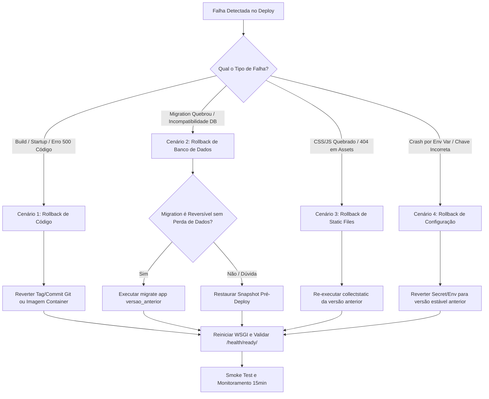

# Plano de Rollback e Recuperação de Deploy

## Instituto Mente em Foco — Arquitetura de Produção

---

## 1. Visão Geral e Princípios Fundamentais

O presente **Plano de Rollback** define os procedimentos operacionais para reverter versões do sistema em produção de forma rápida, segura e controlada quando um deploy apresentar falhas críticas ou instabilidade insustentável.

### 1.1 Objetivos de Serviço de Rollback
- **RTO de Rollback (Recovery Time Objective):** $\le 15$ minutos para restabelecer a estabilidade e disponibilidade do serviço.
- **RPO de Dados (Recovery Point Objective):** 0 minutos (sem perda de agendamentos ou contatos de pacientes gerados durante o incidente), priorizando correções compatíveis antes de restaurações destrutivas.

### 1.2 Princípios de Engenharia
1. **Prioridade Absoluta ao Paciente/Usuário:** Restaurar o canal de atendimento e agendamento imediatamente.
2. **Backward-Compatibility First:** Toda alteração de schema e código deve seguir o padrão *Expand and Contract*. Migrações devem ser compatíveis com a versão anterior do código.
3. **Decisão Baseada em Métricas e Critérios Claros:** Evitar hesitações no momento de estresse operacional através de uma matriz binária de decisão (Rollback vs. Fix-Forward).
4. **Sem Destruição Cega de Dados:** Nunca executar `migrate <app> <anterior>` ou restaurar snapshots sem antes avaliar o impacto em dados gravados durante a janela de release.

---

## 2. Matriz de Decisão: Rollback vs. Fix-Forward

| Critério | Executar Rollback Imediato | Executar Fix-Forward (Correção a Quente) |
| :--- | :--- | :--- |
| **Gravidade** | Site fora do ar (5xx em massa), crash no startup, falha no banco de dados, brecha de segurança exposta. | Erro de digitação cosmético, bug em rota não-crítica com workaround imediato. |
| **Tempo Estimado de Resolução** | Correção demandará mais de 10 minutos de depuração, build e testes. | Causa raiz identificada de imediato com patch simples realizável e testável em $< 10$ minutos. |
| **Complexidade da Alteração** | Múltiplas dependências alteradas, migrations estruturais com drop/rename. | Ajuste pontual em template ou variável de ambiente. |
| **Integridade de Dados** | Risco de corrupção ou gravação incorreta de novos leads/mensagens. | Sem risco a integridade dos dados no banco. |

> [!CAUTION]
> Se houver dúvida se o problema pode ser corrigido em menos de 10 minutos, **a regra é acionar o ROLLBACK imediatamente**. A prioridade é manter o serviço estável.

---

## 3. Cenários Operacionais de Rollback



---

### Cenário 1: Falha no Build, Startup ou Erros 500 em Massa (Código)

**Sintomas:**
- `/health/` responde 500 ou time-out.
- Gunicorn/Uvicorn em crash-loop nos logs do servidor.
- Sintaxe Python incompatível ou exceção não tratada ao importar módulos.

**Procedimento de Rollback:**
1. **Identificar a última release estável (Tag Git ou Commit Hash):**
   ```bash
   git tag --sort=-creatordate
   # Exemplo de tag estável anterior: v1.0.0
   ```
2. **Reverter a branch de produção para o commit/tag anterior:**
   ```bash
   git checkout tags/v1.0.0
   # Em caso de deploy contínuo via branch principal:
   # git revert HEAD --no-edit && git push origin main
   ```
3. **Reconstruir dependências e reiniciar o serviço:**
   ```bash
   pip install -r requirements.txt
   systemctl restart gunicorn  # ou o comando correspondente no PaaS (ex: redeploy da release anterior)
   ```
4. **Verificar restabelecimento do serviço:**
   ```bash
   curl -I https://meudominio.com.br/health/
   curl -I https://meudominio.com.br/health/ready/
   ```

---

### Cenário 2: Falha após Migrations Executadas (Incompatibilidade com Banco de Dados)

**Sintomas:**
- `OperationalError`, `ProgrammingError` ou `UndefinedTable` nos logs do Django.
- `/health/ready/` responde HTTP 503 com status `"database": "unavailable"`.

#### 2.1 Padrão de Engenharia Preventiva: Expand and Contract
Para evitar downtime e rollbacks traumáticos, toda alteração de schema no Instituto Mente em Foco deve ser realizada em 2 etapas:
- **Fase 1 (Expand):** Adicionar colunas novas como opcionais (`null=True, blank=True`). Código novo lê nova coluna, código antigo lê antiga.
- **Fase 2 (Contract):** Após código estável em produção por semanas, removem-se as colunas antigas em migration separada.

#### 2.2 Quando FAZER Rollback de Migration via Django CLI:
- Quando a migration adicionou uma tabela ou coluna que não contém dados críticos novos e cuja remoção não gera cascata destrutiva.
- **Comando:**
  ```bash
  python manage.py migrate <nome_do_app> <numero_migration_anterior>
  # Exemplo: python manage.py migrate contato 0002_adiciona_campo_x
  ```

#### 2.3 Quando NÃO FAZER Rollback de Migration via CLI:
- Quando a migration executou operações irreversíveis (ex: união de tabelas, conversão destrutiva de tipo de dado, drop de colunas legadas).
- Se novos contatos ou agendamentos já foram gravados na nova estrutura durante a janela do incidente.
- **Ação:** Nesses casos, prefira **Fix-Forward** com uma migration corretiva rápida gerada em homologação, OU recorra à restauração do backup.

#### 2.4 Procedimento de Emergência: Restauração do Backup Pré-Deploy
Se a base ficou inconsistente e o rollback via Django falhar:
1. **Parar a aplicação:**
   ```bash
   systemctl stop gunicorn
   ```
2. **Restaurar o dump gerado imediatamente antes do deploy (conforme `PLANO_BACKUP_E_RESTAURACAO.md`):**
   ```bash
   pg_restore --clean --if-exists --no-owner --no-acl \
     -h $DB_HOST -p $DB_PORT -U $DB_USER -d $DB_NAME \
     /var/backups/postgres/pre_deploy_backup.dump
   ```
3. **Reverter o código para a versão compatível com a base restaurada.**
4. **Reiniciar o servidor e validar `/health/ready/`.**

---

### Cenário 3: Falha de Assets Estáticos (CSS Quebrado, Hash Mismatch, 404 em Assets)

**Sintomas:**
- Páginas renderizam sem formatação CSS (layout quebrado).
- `MissingStaticFilesManifestKey: Missing staticfiles manifest entry for 'css/estilo.css'`
- Navegador reporta 404 para arquivos sob `/static/` com hash SHA antigo.

**Procedimento de Rollback:**
1. **Re-executar o collectstatic no release anterior:**
   ```bash
   python manage.py collectstatic --noinput --clear
   ```
2. **Limpar caches intermediários e CDN (se aplicável):**
   - No Cloudflare/CDN: Acionar **Purge Cache -> Purge Everything**.
   - No Nginx/Reverse Proxy:
     ```bash
     rm -rf /var/cache/nginx/*
     systemctl reload nginx
     ```
3. **Testar requisição direta com bypass de cache:**
   ```bash
   curl -I "https://meudominio.com.br/static/css/estilo.css?v=$(date +%s)"
   ```

---

### Cenário 4: Falha de Variáveis de Ambiente e Configuração

**Sintomas:**
- `django.core.exceptions.ImproperlyConfigured` no startup.
- Aplicação recusa conexões com erro de autenticação no banco (`FATAL: password authentication failed`).
- Chave de segurança inválida ou SMTP inacessível.

**Procedimento de Rollback:**
1. **Reverter o arquivo `.env` ou o painel de secrets do PaaS para o backup estável (`.env.backup`):**
   ```bash
   cp /etc/mente_em_foco/.env.backup /etc/mente_em_foco/.env
   chmod 600 /etc/mente_em_foco/.env
   ```
2. **Reiniciar os processos da aplicação:**
   ```bash
   systemctl restart gunicorn
   ```
3. **Conferir `/health/ready/`.**

---

## 4. Checklist de Ações Pós-Rollback

Após a execução do rollback e a estabilização dos serviços, a equipe técnica deve cumprir obrigatoriamente as seguintes etapas:

- [ ] **1. Smoke Test Completo:** Validar Página Inicial, Serviços, Sobre, Contato, Envio de Formulário e Área Administrativa.
- [ ] **2. Monitoramento Ativo (30 minutos):** Observar logs de erro (`5xx`) no servidor de aplicação e status dos endpoints de health check.
- [ ] **3. Notificação das Partes Interessadas:** Comunicar à proprietária/responsável que a versão anterior foi restabelecida com sucesso e o site opera normalmente.
- [ ] **4. Bloqueio de Novos Deploys:** Nenhum novo deploy para produção é permitido até a conclusão da investigação do incidente e correção em ambiente local/staging.
- [ ] **5. Condução do Post-Mortem (Sem Culpa / Blameless):**
  - O que aconteceu? (Linha do tempo precisa do incidente).
  - Por que aconteceu? (Causa raiz técnica e falha nos testes ou processo).
  - Como o problema foi mitigado? (Eficácia do rollback).
  - Quais ações preventivas serão implementadas para que não ocorra novamente? (Novos testes automatizados, checagens prévias).
- [ ] **6. Registro no Histórico:** Atualizar `documentacao/HISTORICO_DE_IMPLEMENTACAO.md` com a narrativa do incidente e aprendizados técnicos.
